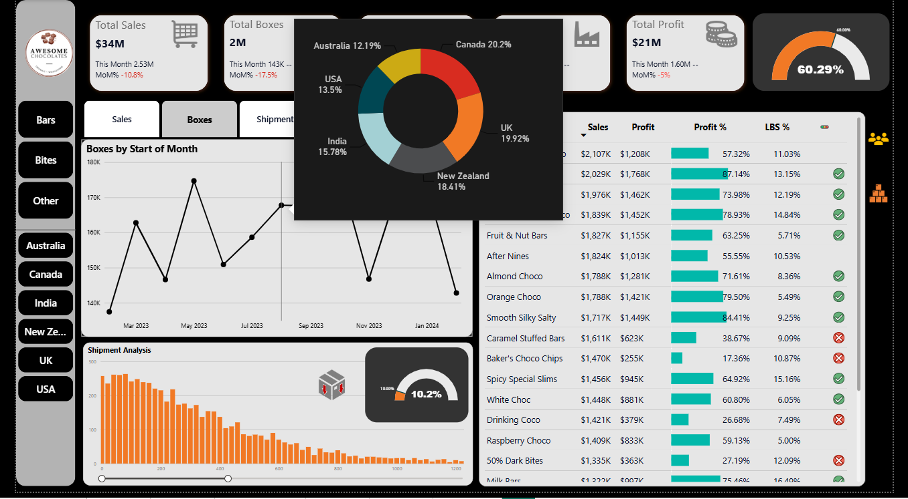

# 🍫 Chocolate Sales Dashboard | Power BI

---

## 📌 Project Overview

This interactive Power BI dashboard analyzes chocolate sales performance across multiple countries and products.

It enables users to monitor business KPIs, identify profitable products, compare country-wise sales, and explore shipment performance using interactive visualizations.

---

## 📷 Dashboard Preview

---

## 🎥 Dashboard Demo

Download the demo video from this repository:

**dashboard-demo.mp4**

---

## 📊 Business KPIs

- 💰 Total Sales
- 📦 Total Boxes Sold
- 🚚 Total Shipments
- 💵 Total Profit
- 📈 Profit %
- 📉 Month-over-Month Performance

---

## 📈 Dashboard Features

- Interactive Country Filters
- Product Category Filters
- KPI Cards
- Sales Trend Analysis
- Donut Chart
- Gauge Chart
- Shipment Distribution
- Product Profitability Table
- Conditional Formatting

---

## 🛠 Tools & Technologies

- Power BI Desktop
- DAX
- Power Query
- Microsoft Excel

---

## 📂 Repository Contents

| File | Description |
|------|-------------|
| Chocolate Sales Dashboard.pbix | Power BI Project |
| dashboard-preview.png | Dashboard Preview |
| dashboard-demo.mp4 | Dashboard Walkthrough |

---

## 💡 Skills Demonstrated

- Data Cleaning
- Data Transformation
- Data Modeling
- DAX Calculations
- Business Intelligence
- Dashboard Design
- Data Visualization

---

## 🚀 How to Use

1. Download the `.pbix` file.
2. Open it using Power BI Desktop.
3. Refresh the dataset if required.
4. Explore the dashboard using the slicers and filters.

---

## 👨‍💻 Author

### Kafeel Haji

Aspiring Data Analyst

- SQL
- Power BI
- Excel
- Python

⭐ If you found this project useful, consider giving it a Star.
